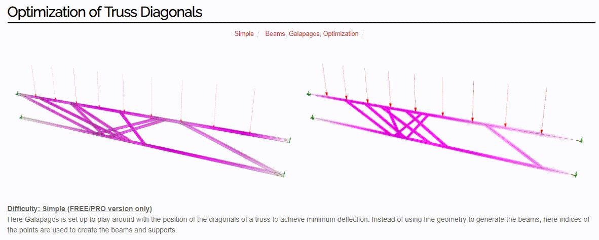
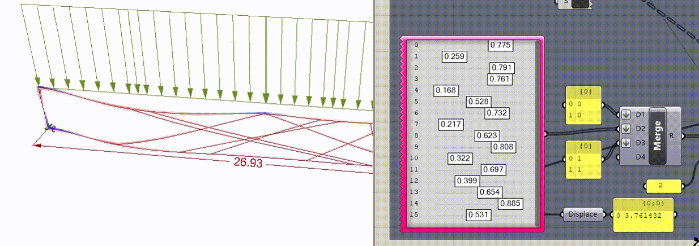
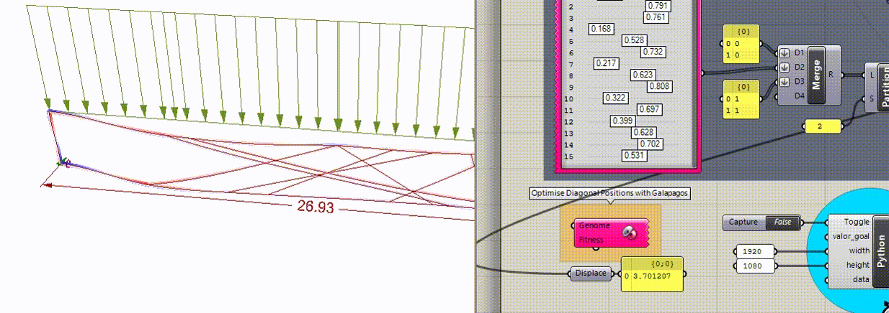
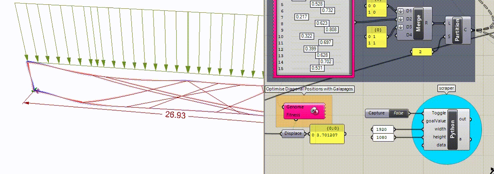

# data-capture

Algorithm for capturing data generated during the optimization process using Grasshopper + Galapagos.

---

## About

The term "Evolutionary Computing" is widely recognized at present, and if you are an architect or civil engineer, you are likely familiar with Galapagos.

For those who are not yet familiar, Galapagos is a native component of Grasshopper that offers a versatile platform for applying Evolutionary Algorithms to a wide range of problems, even for non-programmers.

Despite being highly powerful, the images generated during the Galapagos optimization process are often lost, and the collected data is stored in a manner that makes its analysis challenging and time-consuming. To address this issue, an algorithm has been developed to preserve the most crucial information from this process.

## Operation

This feature operates by capturing Rhino viewports as PNG image files. It saves these images to a folder with the identical name as the GH file, located in the same directory. Additionally, it captures the data utilized as 'genomes' and 'fitness' throughout the Galapagos optimization process, storing it in a CSV file that follows the same naming and location convention as described for the images.

Inputs:

1. Toggle: Enables or disables the component using a boolean value.

2. goalValue: Receives the desired goal value.

3. width: Specifies the width of the screen to be captured.

4. height: Specifies the height of the screen to be captured.

5. data: A list containing the data.

---

## Example

Let's demonstrate the scraper in action on an optimization problem using a model provided by [Karamba](https://www.karamba3d.com/examples/simple/optimization-of-truss-diagonals/).

In this example, Galapagos is configured to adjust the position of the diagonals in a trellis structure to minimize deflection.

Instead of using line geometry to generate the beams, we utilize the indices of the points to create the beams and brackets. .

In this example, Galapagos is configured to play with the position of the diagonals of a trellis to achieve minimum deflection.

Instead of using the line geometry to generate the beams, here the indices of the points are used to create the beams and the brackets.

In the figure below, you can see the input parameters (indices) and the target value to minimize (deflection).

The indices represent the genomes for optimization, and deflection is the fitness value for the process.

To capture the data generated during the Galapagos optimization process, we need to connect the 'Fitness' value (in this case, the deflection value) to the 'goalValue' input of our Scraper component. This ensures that the images receive their corresponding 'Fitness' value as their name. The data, represented by sliding values, which are used as 'Genomes' in Galapagos, should be connected via a 'Merge' node to the 'data' input of our data capturing algorithm.

Before starting the optimization with Galapagos, we need to indicate to the algorithm that it should start functioning. We can do this by setting the Alternate condition to True. This will activate our algorithm whenever there is a change in values, whether it's the sliding values (Genomes) or the Fitness value.

Below is a GIF file created using a portion of the images captured by the algorithm. It shows the type of information (which can be monitored in real-time during the optimization process) that would otherwise be lost.

---

## Data captured

Once the Galapagos evolutionary process is complete, we need to instruct the algorithm to stop functioning. To do this, simply click the Switch again, this time setting it to 'False'.

In the directory where everything is saved, you will find a CSV file containing all the data for each iteration, as well as a folder containing the respective images.

Now you have all the data necessary to delve deeper into the analysis of your work.

---

## References

1. Code made available by Anders Holden Deleuran in this [discussion](https://discourse.mcneel.com/t/a-way-to-screencapture-and-send-to-print-with-one-button/76015/5).

2. Example of optimization available in [karamba](https://www.karamba3d.com/examples/simple/optimization-of-truss-diagonals/).
