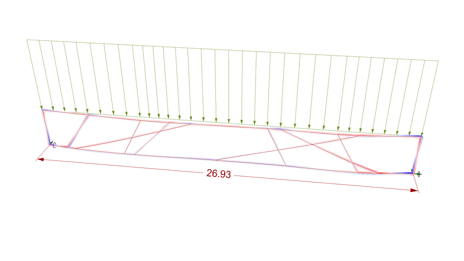

# data-capture

Algorithm to capture data produced during the optimization process using Grasshopper + Galapagos

## About

The term "Evolutionary Computing" is widely known at this time and if you are an architect or civil engineer you surely already know the Galapagos.

For those who do not yet know, Galapagos is a native component of Grasshopper and provides a generic platform for the application of Evolutionary Algorithms to be used in a wide variety of problems by non-programmers.

Although very powerful, the images produced during the Galapagos optimization process are lost and the generated data is stored in a way that makes its analysis difficult and laborious. Thinking about this, this algorithm was developed so that the most important information of this process is preserved.

## Operation

This feature works by capturing Rhino viewports as PNG image files. It saves these images to a folder with the same name as the GH file and in the same directory where it is. It also captures the data used as 'genomes' and 'fitness' during the Galapagos optimization process in a CSV file, assigning it name and location in the same way as described for the images.

Inputs:

1. Toggle: Activates the component using a boolean;

2. goalValue: receives the goal value;

3. width: width of the screen to be captured;

4. height: height of the screen to be captured;

5. data: list of data.

## Example

As a demonstration, let's look at the scraper in action on an optimization problem. For this, we use a model provided by [Karamba](https://www.karamba3d.com/examples/simple/optimization-of-truss-diagonals/).

In this example, Galapagos is configured to play with the position of the diagonals of a trellis to achieve minimum deflection.

Instead of using the line geometry to generate the beams, here the indices of the points are used to create the beams and the brackets.

In the figure below, we can see the input parameters (indices) and the target value of being minimized (deflection).

Where indecisions are the genomes of optimization and deflection is the fitness value of the process.

To capture the data produced during the Galapagos generative process, we must connect the deflection value to 'goalValue' and the list of indeces in 'date' in the capture algorithm.

Finally, before starting the optimization with Galapagos, we must click the Toggle (True), condition for the algorithm to start its work.

